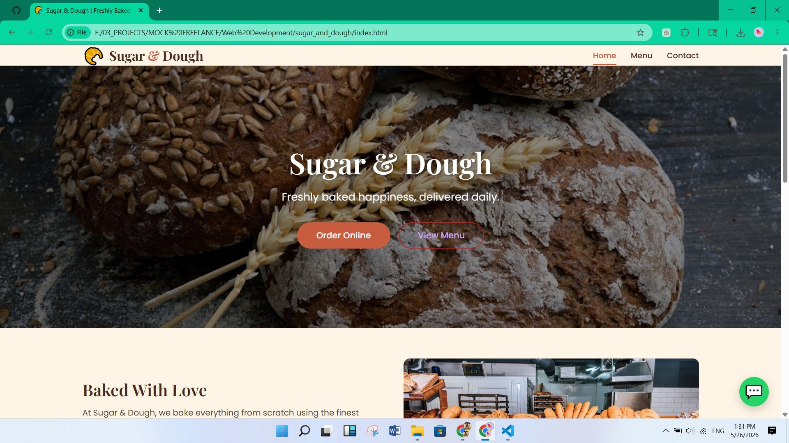
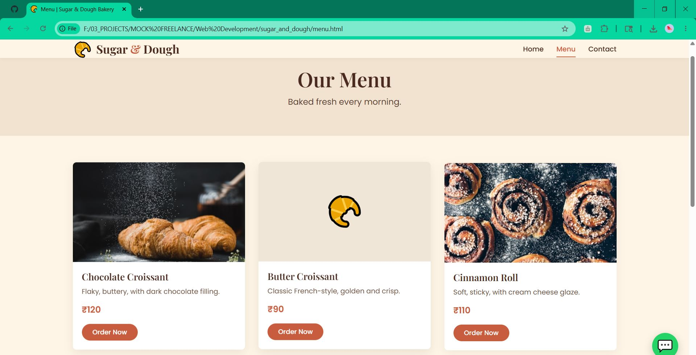
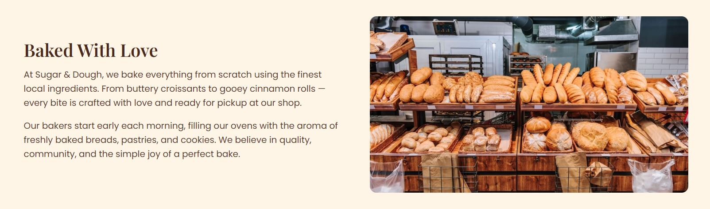
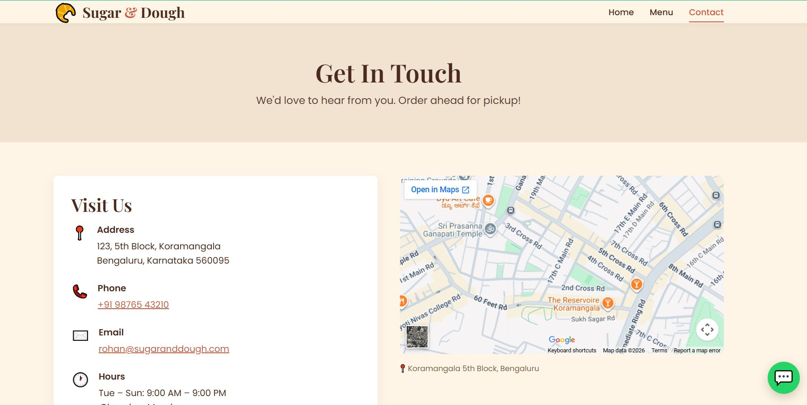
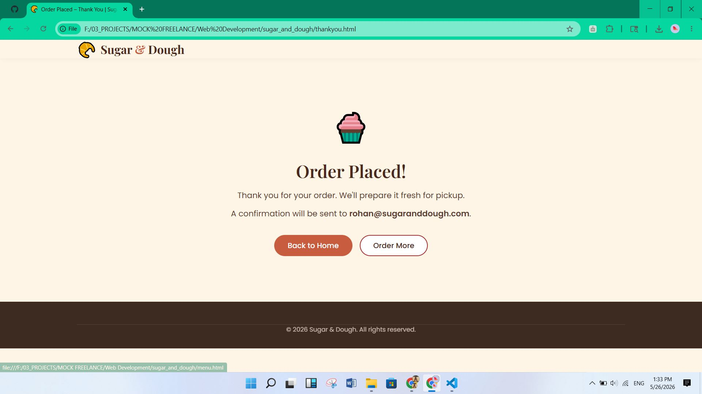

# 🥐 Sugar & Dough
**Freshly Baked Happiness** — A Modern, Responsive Bakery Website

---

## ✨ Overview

**Sugar & Dough** is a beautifully designed, responsive bakery website built with modern web technologies. This project showcases a professional online presence for a bakery business, featuring a seamless user experience with menu browsing, contact forms, and order management capabilities.

Perfect for showcasing baking products, accepting customer inquiries, and building brand presence online.

---

## 📊 Badges


---

## ⭐ Key Features

- 🍰 **Modern, Clean Design** — Professional UI with elegant typography and smooth interactions
- 📱 **Fully Responsive** — Optimized for mobile, tablet, and desktop devices with hamburger menu
- 🎨 **Beautiful Styling** — Custom CSS with Google Fonts (Playfair Display, Poppins)
- ✅ **Form Validation** — Live inline validation for contact and order forms
- 📧 **Form Integration** — Powered by Formspree for seamless form submissions
- 🎉 **Interactive Elements** — Smooth animations and confetti effects for order confirmation
- ♿ **Accessibility** — ARIA labels and semantic HTML for better accessibility
- ⚡ **Performance Optimized** — Clean, vanilla JavaScript with no unnecessary dependencies
- 🗂️ **Multi-Page Structure** — Home, Menu, Contact, and Thank You pages
- 🎯 **SEO Ready** — Proper meta tags and semantic markup

---

## 📸 Screenshots

### Home Page
A stunning hero section with compelling call-to-action and featured products display.



### Menu Page  
Browse the complete bakery menu with product details and pricing.



### About Section
Learn about Sugar & Dough's story, values, and baking philosophy.



### Contact Page
Easy-to-use contact form with embedded map for location information.



### Thank You Page
Celebratory confirmation page with confetti effect after order submission.



---

## 🛠️ Tech Stack

| Technology | Purpose |
|-----------|---------|
| **HTML5** | Semantic markup and page structure |
| **CSS3** | Modern styling, flexbox, and responsive grid |
| **Vanilla JavaScript** | Interactivity, form validation, and dynamic behavior |
| **Google Fonts** | Typography (Playfair Display, Poppins) |
| **Formspree** | Backend form handling and email notifications |
| **Responsive Design** | Mobile-first approach with media queries |

---

## 🚀 Installation & Setup

### Prerequisites
- A modern web browser (Chrome, Firefox, Safari, Edge)
- No server or build tools required — plain HTML/CSS/JS

### Quick Start

1. **Clone the repository**
   ```bash
   git clone https://github.com/yourusername/sugar-and-dough.git
   cd sugar-and-dough
   ```

2. **Open in browser**
   - Simply open `index.html` in your preferred web browser
   - Or use a local server (optional):
   ```bash
   # Using Python 3
   python -m http.server 8000
   
   # Using Node.js (with http-server)
   npx http-server
   ```

3. **Access the site**
   - Local: `http://localhost:8000` (if using server)
   - Direct: Open `index.html` directly in browser

### Configuration

For form submissions to work:
1. Update the Formspree form ID in `contact.html` and `menu.html`
2. Replace placeholder email with your actual email address
3. Test form submission from the live website

---

## 💻 Usage

### For Visitors
- Browse the menu and product offerings
- Fill out contact forms for inquiries
- Place orders directly through the website
- Receive order confirmation with celebratory animation

### For Developers
- **Customize Styling**: Edit `css/style.css` for color schemes and `css/responsive.css` for breakpoints
- **Add Menu Items**: Update `menu.html` with new products
- **Extend Functionality**: Add features in `js/main.js`
- **Responsive Testing**: Test across different screen sizes

---

## 📁 Folder Structure

```
sugar_and_dough/
├── index.html              # Home page
├── menu.html               # Menu/Products page
├── contact.html            # Contact & Order page
├── thankyou.html           # Order confirmation page
├── README.md               # Project documentation
│
├── css/
│   ├── style.css           # Main stylesheet
│   └── responsive.css      # Media queries for mobile/tablet
│
├── js/
│   └── main.js             # JavaScript functionality
│
├── images/                 # Product and design images
│
└── assets/
    └── screenshots/        # Project screenshots
        ├── home_page.JPG
        ├── menu_page.JPG
        ├── about_section.JPG
        ├── contat_with_map.JPG
        └── thank_you_page.JPG
```

---

## 🎯 Key Functionality

### Mobile Hamburger Menu
- Responsive navigation that collapses on smaller screens
- Smooth toggle animation
- Accessible ARIA labels

### Form Validation
- Real-time inline validation for contact forms
- Email and phone number verification
- User-friendly error messages

### Dynamic Features
- Automatically updates footer year
- URL parameters for pre-filling form data
- AJAX form submission with smooth redirect
- Confetti animation on order confirmation

### Responsive Design
- Mobile-first approach
- Optimized breakpoints for tablet and desktop
- Touch-friendly interactive elements

---

## 🚀 Future Enhancements

- [ ] Shopping cart functionality with order management
- [ ] Customer testimonials and reviews section
- [ ] Blog/News page for bakery updates
- [ ] Image gallery with lightbox effect
- [ ] Payment gateway integration (Stripe/PayPal)
- [ ] Admin dashboard for menu management
- [ ] Newsletter subscription form
- [ ] Social media integration
- [ ] Dark mode toggle
- [ ] Multi-language support
- [ ] Analytics and tracking
- [ ] Advanced search functionality

---

## 📝 License

This project is licensed under the **MIT License** — feel free to use, modify, and distribute.

See the [LICENSE](LICENSE) file for more details.

---

## 👤 Author

**Sugar & Dough** is a portfolio project showcasing modern web development practices.

### Contact
- 📧 Email: your-email@example.com
- 🌐 Portfolio: [Your Portfolio Website]
- 💼 LinkedIn: [Your LinkedIn Profile]
- 🐙 GitHub: [@yourusername](https://github.com/yourusername)

---

## 🤝 Contributing

Contributions are welcome! If you'd like to improve Sugar & Dough:

1. Fork the repository
2. Create a feature branch (`git checkout -b feature/amazing-feature`)
3. Commit your changes (`git commit -m 'Add some amazing feature'`)
4. Push to the branch (`git push origin feature/amazing-feature`)
5. Open a Pull Request

---

## 📞 Support & Issues

If you encounter any issues or have suggestions:
- Open an issue on GitHub
- Check existing documentation
- Contact via email

---

## 🎉 Acknowledgments

- Google Fonts for beautiful typography
- Formspree for form handling
- Unsplash for high-quality images
- Community feedback and support

---

<div align="center">

**Made with ❤️ and fresh-baked love 🥐**

[⭐ Star this repo](#) | [🍴 Fork it](#) | [📫 Follow](#)

</div>
